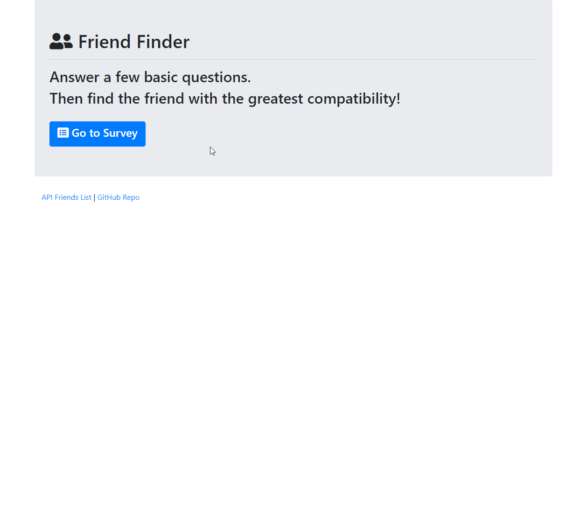

# FriendFinder

## Overview
This full-stack site will take in results from your users' surveys, then compare their answers with those from other users. 
 
The app will then display the name and picture of the user with the best overall match.

## Instructions
Visit this link: [https://morning-tundra-77865.herokuapp.com/]
 

### To Use
Click "Go to Survey" to start the survey.
 
Enter your name, add a picture, and answer the questions. You must answer all to continue. 
 
Your result will be shown in a modal.

 
## Built With
* node.js
* JavaScript
* HTML
* CSS
* jQuery
* [Bootstrap 4](https://getbootstrap.com/)-for CSS library
* [express from npm](https://www.npmjs.com/package/express)-for interface in console

## Author
* Kayleigh Starr